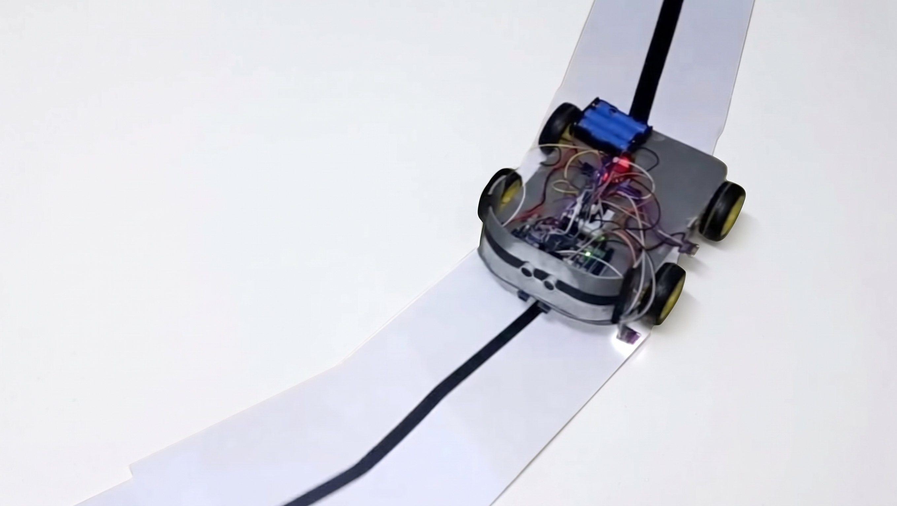
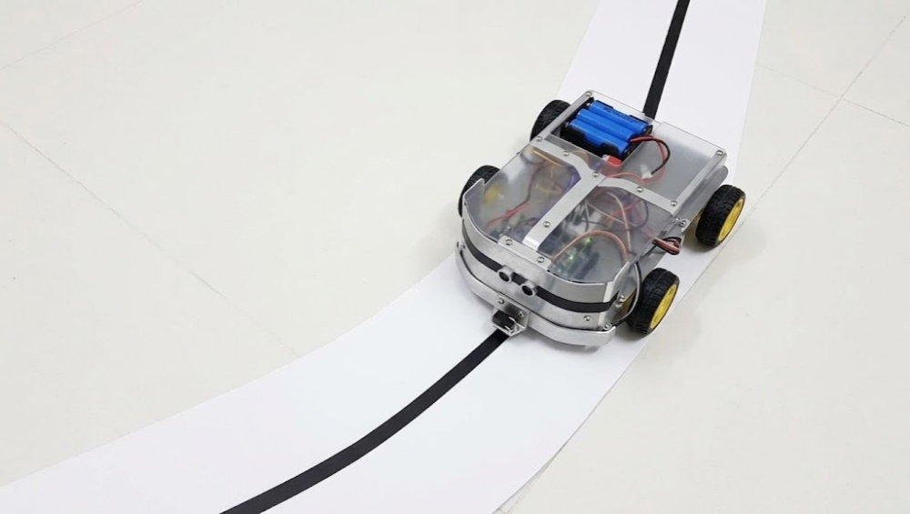
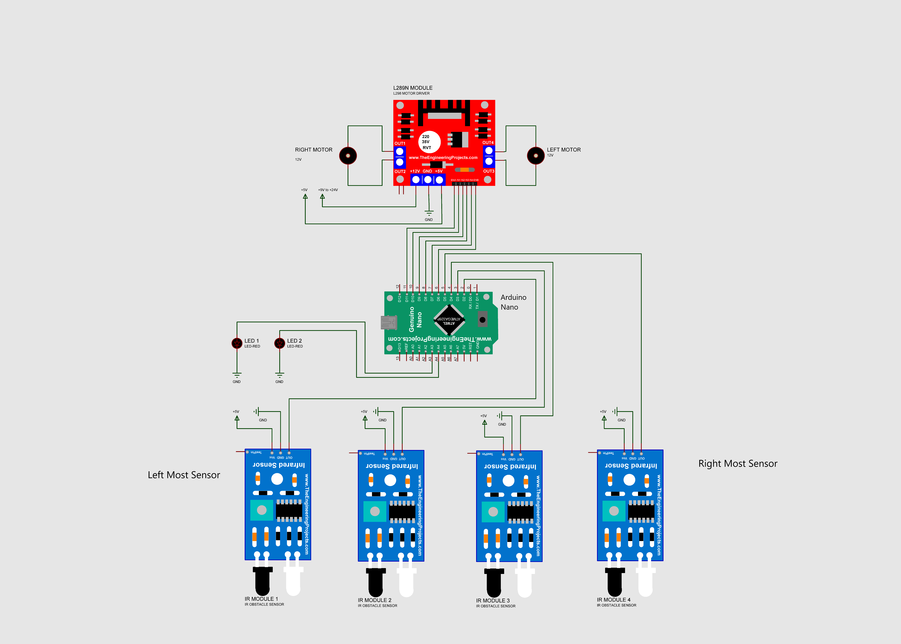

# 🤖 Autonomous Line Follower Robot — LORA 2023 Competition

[](https://opensource.org/licenses/MIT)
[](https://www.arduino.cc/)
[](https://isocpp.org/)
[]()

> Autonomous robotic system designed and developed for the **LORA 2023** (Ligue d'Orientation & Robotique Autonome) competition. The robot features optical line following, dual I2C RGB color recognition, ultrasonic obstacle detection, and an integrated servo-actuated mechanism for competition tasks.

---

## 📸 Robot Showcase

| Prototype Iteration 1 (Chassis Assembly) | Prototype Iteration 2 (Full Sensor & Actuator Integration) |
| :---: | :---: |
|  |  |

---

## 🎥 Video Demonstration

Check out the line follower in action during tracking tests:

https://github.com/user-attachments/assets/demo

> 📹 **Video File**: [docs/media/test_line_following.mp4](docs/media/test_line_following.mp4)

---

## 📋 Table of Contents

- [Overview](#-overview)
- [Robot Showcase](#-robot-showcase)
- [Video Demonstration](#-video-demonstration)
- [Key Features](#-key-features)
- [Hardware Architecture & Components](#-hardware-architecture--components)
- [Circuit Diagram & Pinout](#-circuit-diagram--pinout)
- [Repository Structure](#-repository-structure)
- [Algorithm & State Logic](#-algorithm--state-logic)
- [Installation & Getting Started](#-installation--getting-started)
- [Calibration & Tuning](#-calibration--tuning)
- [Competition Results & Lessons Learned](#-competition-results--lessons-learned)
- [License](#-license)

---

## 🎯 Overview

The **LORA 2023 Line Follower** was engineered to autonomously navigate complex tracks, handle intersections, detect color-coded mission zones (Red, Green, Blue), detect obstacles in real time, and trigger physical actions (e.g. servo-driven gripper/gate) based on track markings.

### Competition Highlights:
* **Track Navigation**: High-contrast black line tracking over white surface with dynamic trajectory correction.
* **Color Detection**: Real-time identification of RGB markers using dual TCS34725 optical sensors.
* **Obstacle Handling**: Non-contact distance measurement via HC-SR04 ultrasonic sound waves.
* **Actuation**: Servo motor automated sequence triggered upon designated color zones.

---

## ✨ Key Features

- **Dual-Sensor IR Line Following**: Real-time differential steering based on TCRT5000 IR sensor feedback.
- **Dual RGB Color Processing**: Adafruit TCS34725 color sensing for mission zone identification:
  - 🔴 **Red Zone**: Stop + Trigger servo mechanism (e.g., release/catch object).
  - 🟢 **Green Zone**: Safe temporary stop / Checkpoint confirmation (5s delay).
  - 🔵 **Blue Zone**: Strategic checkpoint pause (2s delay).
- **Ultrasonic Range Finder**: HC-SR04 obstacle detection to prevent track collisions.
- **Modular Codebase**: Individual test and calibration sketches for every onboard sensor and actuator.

---

## 🛠 Hardware Architecture & Components

| Component | Model / Description | Quantity | Purpose |
| :--- | :--- | :---: | :--- |
| **Microcontroller** | Arduino Uno R3 (ATmega328P) | 1 | Main brain & decision logic |
| **Motor Driver** | L298N Dual H-Bridge | 1 | DC motor power & PWM speed control |
| **Motors** | TT Gearmotors (3V-6V DC) | 2 | Differential drive |
| **Line Sensors** | TCRT5000 / Optical IR Sensor Modules | 2 | Left / Right line detection |
| **Color Sensors** | Adafruit TCS34725 RGB Color Sensors | 2 | Zone & marker identification |
| **Distance Sensor**| HC-SR04 Ultrasonic Sensor | 1 | Frontal obstacle detection |
| **Actuator** | SG90 / MG995 Micro Servo | 1 | Mechanism actuation (Gripper / Gate) |
| **Power Supply** | 2x 18650 Li-ion batteries (7.4V) | 1 | Main robotics power source |

---

## 🔌 Circuit Diagram & Pinout



### Pin Mapping Table (Arduino Uno)

| Arduino Pin | Connection / Component | Mode | Function |
| :--- | :--- | :--- | :--- |
| **Pin 10** | L298N `ENA` | `OUTPUT` | Right Motor Speed (PWM) |
| **Pin 9** | L298N `IN1` | `OUTPUT` | Right Motor Direction 1 |
| **Pin 8** | L298N `IN2` | `OUTPUT` | Right Motor Direction 2 |
| **Pin 7** | L298N `IN3` | `OUTPUT` | Left Motor Direction 1 |
| **Pin 6** | L298N `IN4` | `OUTPUT` | Left Motor Direction 2 |
| **Pin 5** | L298N `ENB` | `OUTPUT` | Left Motor Speed (PWM) |
| **Pin 4** | Servo Signal | `OUTPUT` | Servo PWM Control |
| **Pin 3** | HC-SR04 `Trig` | `OUTPUT` | Ultrasonic Pulse Trigger |
| **Pin 2** | HC-SR04 `Echo` | `INPUT` | Ultrasonic Echo Return |
| **Pin A0** | Right IR Sensor (`R_S`) | `INPUT` | Right Line Sensor (Analog/Digital) |
| **Pin A1** | Left IR Sensor (`L_S`) | `INPUT` | Left Line Sensor (Analog/Digital) |
| **Pin A4** | TCS34725 `SDA` | `I2C` | I2C Data Line |
| **Pin A5** | TCS34725 `SCL` | `I2C` | I2C Clock Line |

---

## 📁 Repository Structure

```plaintext
Robotic-LORA-2023/
├── .gitignore
├── LICENSE
├── README.md
├── src/
│   ├── LORA_LineFollower_Main/       # ⭐ Main competition sketch
│   │   └── LORA_LineFollower_Main.ino
│   ├── LineFollower_Basic/           # Basic 2-IR differential line follower
│   │   └── LineFollower_Basic.ino
│   └── tests/                        # Dedicated sensor calibration & test scripts
│       ├── IR_TCRT5000/              # TCRT5000 IR sensor threshold tester
│       │   └── IR_TCRT5000.ino
│       ├── RGB_Single_TCS34725/      # Single TCS34725 RGB sensor test
│       │   └── RGB_Single_TCS34725.ino
│       └── RGB_Dual_TCS34725/        # Dual TCS34725 RGB sensor test
│           └── RGB_Dual_TCS34725.ino
├── docs/
│   ├── diagrams/
│   │   └── circuit_diagram.png       # Hardware schematics & wiring reference
│   └── media/                        # Project photos & test video demonstration
│       ├── robot_version_1.png       # Prototype iteration 1
│       ├── robot_version_2.png       # Prototype iteration 2
│       └── test_line_following.mp4   # Video demonstration of line following
├── libraries/                        # Dependency zip archives (Adafruit TCS34725)
│   └── Adafruit_TCS34725-master.zip
└── reference/                        # Schematics and ESP32 PID prototype reference
    └── PID-Line-Follower-Robot-main/
```

---

## 🧠 Algorithm & State Logic

### 1. Line Navigation Logic

```mermaid
flowchart TD
    Start([Loop Cycle]) --> ReadIR[Read Left & Right IR Sensors]
    ReadIR --> Decision{Sensor States}
    
    Decision -->|L=0, R=0 (White/White)| Forward[Move Forward]
    Decision -->|L=0, R=1 (White/Black)| TurnRight[Turn Right]
    Decision -->|L=1, R=0 (Black/White)| TurnLeft[Turn Left]
    Decision -->|L=1, R=1 (Black/Black)| Stop[Stop Motors]
    
    Forward --> CheckColor[Check Color & Obstacles]
    TurnRight --> CheckColor
    TurnLeft --> CheckColor
    Stop --> CheckColor
    
    CheckColor --> End([Next Cycle])
```

### 2. Color Recognition & Mission Triggers

| Detected Color | Primary Condition | Action Executed |
| :--- | :--- | :--- |
| **Red** | `Red > 1500 && Red > Green && Red > Blue` | Stop motors $\to$ Open Servo (30°) $\to$ Wait 5s $\to$ Close Servo (160°) |
| **Green** | `Green > 1500 && Green > Red && Green > Blue` | Stop motors $\to$ Pause 5s $\to$ Resume |
| **Blue** | `Blue > 1500 && Blue > Red && Blue > Green` | Stop motors $\to$ Pause 2s $\to$ Resume |

---

## 🚀 Installation & Getting Started

### 1. Prerequisites
- [Arduino IDE](https://www.arduino.cc/en/software) (Version 1.8.x or 2.x)
- Required Arduino Libraries:
  - `Adafruit_TCS34725` (Install via Arduino Library Manager or from `libraries/`)
  - `Servo` (Built-in standard library)
  - `Wire` (Built-in standard library)

### 2. Setup Instructions
1. Clone this repository:
   ```bash
   git clone https://github.com/<your-username>/Robotic-LORA-2023.git
   ```
2. Open `src/LORA_LineFollower_Main/LORA_LineFollower_Main.ino` in the Arduino IDE.
3. Select your board: **Tools $\to$ Board $\to$ Arduino Uno**.
4. Select your COM port: **Tools $\to$ Port $\to$ COMx**.
5. Click **Upload** (Ctrl + U).

---

## ⚙ Calibration & Tuning

1. **IR Sensor Sensitivity**: Adjust the onboard potentiometer on each TCRT5000 module until the onboard LED switches cleanly between the track surface (White) and the tape (Black).
2. **Color Sensor Thresholds**: Upload `src/tests/RGB_Single_TCS34725/` or `src/tests/RGB_Dual_TCS34725/`, open the Serial Monitor (9600 baud), and record ambient RGB levels over competition markers. Adjust the thresholds in `LORA_LineFollower_Main.ino`:
   ```cpp
   const int RED_THRESHOLD_1 = 1500;
   const int GREEN_THRESHOLD_1 = 1500;
   const int BLUE_THRESHOLD_1 = 1500;
   ```
3. **Motor Speed Balance**: Adjust `DEFAULT_SPEED` (100 to 255) to achieve optimal track stability vs speed.

---

## 🏆 Competition Results & Lessons Learned

- Designed and competed during the **LORA 2023** robotics challenge.
- Successfully implemented autonomous color-based checkpoint logic and obstacle avoidance on an embedded 8-bit ATmega328P platform.

---

## 📄 License

This project is licensed under the **MIT License** - see the [LICENSE](LICENSE) file for details.

---

**Author:** [Otmani Amine](https://github.com/otmaniamine)  
**Year:** 2023 – 2026
